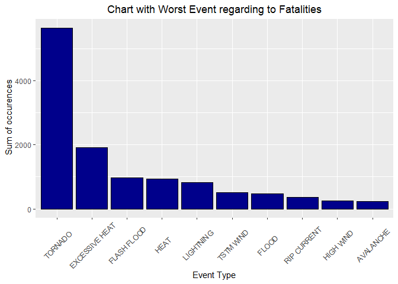
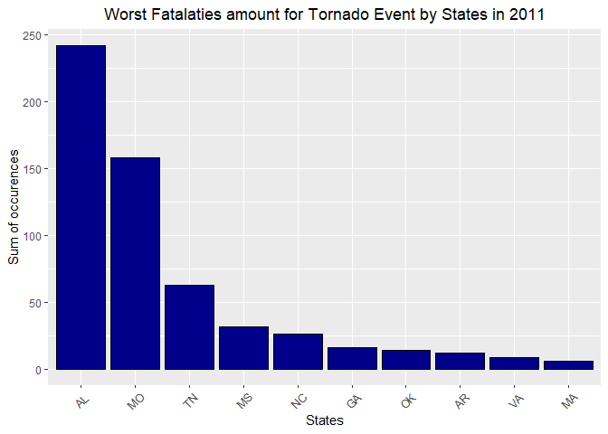
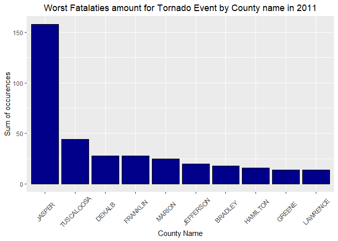
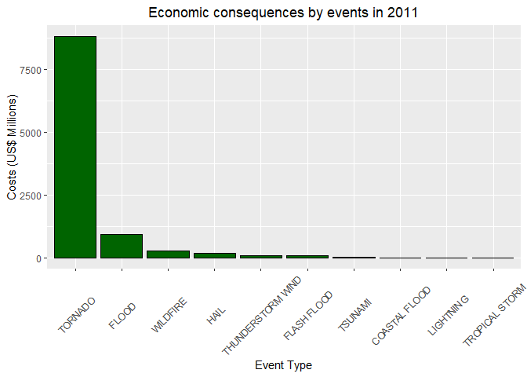

GitHub: [NOAA Project](https://github.com/Cristianneuhaus/RepData_PeerAssessment2)


```r
        knitr::opts_chunk$set(echo=TRUE, warning=FALSE, message=FALSE)
        #setoptions, echo=TRUE
```

#Introduction
Storms and other severe weather events can cause both public health and economic problems for communities and municipalities. Many severe events can result in fatalities, injuries, and property damage, and preventing such outcomes to the extent possible is a key concern.

This project involves exploring the U.S. National Oceanic and Atmospheric Administration's (NOAA) storm database. This database tracks characteristics of major storms and weather events in the United States, including when and where they occur, as well as estimates of any fatalities, injuries, and property damage.

This report shows that Tornado have been the worst event in the United States regarding to Fatalities, Injuries and also for economic impact for the period of time measured. Also this analysis shows details about the behavior of this damages by Counties and States.

To explore the NOAA Storm Database and answer the basic questions about severe weather events. This analysis contain tables, figures, or other summaries using R package to support the analysis.

##Data
The data for this assignment come in the form of a comma-separated-value file compressed via the bzip2 algorithm to reduce its size. You can download the file from the course web site:

  * [Storm Data [47Mb]](https://d396qusza40orc.cloudfront.net/repdata%2Fdata%2FStormData.csv.bz2)


```r
# downloading the data
url <- "https://d396qusza40orc.cloudfront.net/repdata%2Fdata%2FStormData.csv.bz2"

if (!file.exists("StormData.csv.bz2")) {
        download.file(url, "StormData.csv.bz2", mode = "wb")
}
```


There is also some documentation of the database available that you will find how some of the variables are constructed/defined.

 * National Weather Service [Storm Data Documentation](https://d396qusza40orc.cloudfront.net/repdata%2Fpeer2_doc%2Fpd01016005curr.pdf)
 * National Climatic Data Center Storm Events [FAQ](https://d396qusza40orc.cloudfront.net/repdata%2Fpeer2_doc%2FNCDC%20Storm%20Events-FAQ%20Page.pdf)
 
The events in the database start in the year 1950 and end in November 2011. In the earlier years of the database there are generally fewer events recorded, most likely due to a lack of good records. More recent years should be considered more complete.


```r
# Loading the data
storm_data <- read.csv("StormData.csv.bz2", header = TRUE, sep = ",")
```

##Questions
The data analysis address the following questions:  
 
 1. Across the United States, which types of events (as indicated in the <span style = "color:red">EVTYPE</span> are most harmful with respect to population health?
 
 2. Across the United States, which types of events have the greatest economic consequences?

## Data Processing

To prepare the data, it was loaded into R and processed for analysis. The BNG_DATE was convert from factor to Date. In aditional a new data frame, Storm_data_selec, was created selecting the data needed for this analysis. 

Below are the code used for it and a brief of the data.


```r
# Processing the data

library(tidyverse)
library(lubridate)

Storm_data_selec <- storm_data %>%
  select(BGN_DATE, COUNTYNAME, STATE, EVTYPE, FATALITIES, INJURIES, PROPDMG, PROPDMGEXP, CROPDMGEXP) %>%
  filter(FATALITIES > 0 | INJURIES > 0) %>% 
  mutate(BGN_DATE = mdy_hms(BGN_DATE)) %>% 
  mutate(BGN_DATE = format(BGN_DATE,'%Y'))
  
head(Storm_data_selec,5) 
```

```
##   BGN_DATE COUNTYNAME STATE  EVTYPE FATALITIES INJURIES PROPDMG PROPDMGEXP
## 1     1950     MOBILE    AL TORNADO          0       15    25.0          K
## 2     1951    FAYETTE    AL TORNADO          0        2    25.0          K
## 3     1951    MADISON    AL TORNADO          0        2     2.5          K
## 4     1951    CULLMAN    AL TORNADO          0        2     2.5          K
## 5     1951 LAUDERDALE    AL TORNADO          0        6     2.5          K
##   CROPDMGEXP
## 1           
## 2           
## 3           
## 4           
## 5
```

## Analysis on population health

For better understanding of the Events, the bar chart below shows the Top 10 event in order with high Fatalities during all measured period of time. Where Tornado pointed out as the worst event.


```r
Storm_data_selec %>% 
  group_by(EVTYPE) %>% 
  summarise(FATALITIES = sum(FATALITIES), INJURIES = sum(INJURIES)) %>% 
  top_n(10, FATALITIES) %>% 
  arrange(desc(FATALITIES))
```

```
## # A tibble: 10 x 3
##    EVTYPE         FATALITIES INJURIES
##    <fct>               <dbl>    <dbl>
##  1 TORNADO              5633    91346
##  2 EXCESSIVE HEAT       1903     6525
##  3 FLASH FLOOD           978     1777
##  4 HEAT                  937     2100
##  5 LIGHTNING             816     5230
##  6 TSTM WIND             504     6957
##  7 FLOOD                 470     6789
##  8 RIP CURRENT           368      232
##  9 HIGH WIND             248     1137
## 10 AVALANCHE             224      170
```

Two next charts about this data showing the health damages for fatalities and injuries for all the period of time.


```r
# Exploratory Data Analysis

library(ggplot2)
library(dplyr)

Storm_data_selec %>%
  select(EVTYPE,FATALITIES) %>% 
  group_by(EVTYPE) %>% 
  summarise(FATALITIES = sum(FATALITIES)) %>% 
  top_n(10, FATALITIES) %>%
  #arrange(desc(FATALITIES)) %>%
  #function to change the order according to FATALITIES values - factor to integer
  mutate(
    EVTYPE = fct_reorder(EVTYPE, FATALITIES, .desc = TRUE)
  ) %>% 
  ggplot() +
    geom_bar(aes(x = EVTYPE, y = FATALITIES), 
             stat = "identity",
             color = "black",
             fill = "darkblue"
    ) +
    ggtitle("Chart with Worst Event regarding to Fatalities") +
    theme(axis.text.x = element_text(angle = 45, vjust = 0.5),
          plot.title = element_text(hjust = 0.5)
          ) +
    labs(
      x = "Event Type",
      y = " Sum of occurences"
    )
```

<!-- -->

Considering fatalities and injuries, tornado is the worst damage event. 


```r
Storm_data_selec %>%
  select(EVTYPE,INJURIES) %>% 
  group_by(EVTYPE) %>% 
  summarise(INJURIES = sum(INJURIES)) %>% 
  top_n(10, INJURIES) %>%
  #function to change the order according to INJURIES values - factor to integer
  mutate(
    EVTYPE = fct_reorder(EVTYPE, INJURIES, .desc = TRUE)
  ) %>% 
  ggplot() +
    geom_bar(aes(x = EVTYPE, y = INJURIES), 
             stat = "identity",
             color = "black",
             fill = "darkblue"
    ) +
    ggtitle("Chart with Worst Event regarding to Injuries") +
    theme(axis.text.x = element_text(angle = 45, vjust = 0.5),
          plot.title = element_text(hjust = 0.5)
          ) +
    labs(
      x = "Event Type",
      y = " Sum of occurences"
    )
```

<!-- -->

Looking the last twenty years, the two damages for Tornado events increased in 2011 acording to the trend chart below.


```r
Storm_data_selec %>% 
  filter(EVTYPE == 'TORNADO', BGN_DATE >= 1992) %>% 
  group_by(BGN_DATE) %>% 
  summarise(FATALITIES = sum(FATALITIES), INJURIES = sum(INJURIES)) %>% 
  ggplot(aes(x = BGN_DATE, group = 1)) +
    geom_line(aes(y = FATALITIES, color = "darkred")) +
    geom_line(aes(y = INJURIES, color = "steelblue")) +
    scale_color_discrete(name = "Damage:", labels = c("FATALITIES", "INJURIES")) +
    ggtitle("Tornado Event performance by Years") +
    theme(axis.text.x = element_text(angle = 45,vjust = 0.5, size = 12),
          plot.title = element_text(hjust = 0.5)
    ) +
    labs(
      x = "Years",
      y = "Sum of occurences"
    ) 
```

<!-- -->

```r
# chart just with Fatalities

Storm_data_selec %>% 
  filter(EVTYPE == 'TORNADO', BGN_DATE >= 1992) %>% 
  group_by(BGN_DATE) %>% 
  summarise(FATALITIES = sum(FATALITIES)) %>% 
  ggplot(aes(x = BGN_DATE, group = 1)) +
    geom_line(aes(y = FATALITIES, color = "darkred")) +
    scale_color_discrete(name = "Damage:", labels = "FATALITIES") +
    ggtitle("Tornado Event performance by Years") +
    theme(axis.text.x = element_text(angle = 45,vjust = 0.5, size = 12),
          plot.title = element_text(hjust = 0.5)
    ) +
    labs(
      x = "Years",
      y = "Sum of occurences"
    )
```

<!-- -->

Loking the data distribution in 2011 year, the Top 3 worts States with Fatalities are Alabama, Missouri and Tennessee.


```r
Storm_data_selec %>% 
  filter(EVTYPE == 'TORNADO', BGN_DATE == 2011) %>% 
  group_by(STATE) %>% 
  summarise(FATALITIES = sum(FATALITIES), INJURIES = sum(INJURIES)) %>% 
  top_n(10, FATALITIES) %>% 
  mutate(
    STATE = fct_reorder(STATE, FATALITIES, .desc = TRUE)
  ) %>% 
  ggplot() +
    geom_bar(aes(x = STATE, y = FATALITIES), 
             stat = "identity",
             color = "black",
             fill = "darkblue"
    ) +
    ggtitle("Worst Fatalaties amount for Tornado Event by States in 2011") +
    theme(axis.text.x = element_text(angle = 45, vjust = 0.5),
          plot.title = element_text(hjust = 0.5)
          ) +
    labs(
      x = "States",
      y = "Sum of occurences"
    )
```

<!-- -->

The worst County into those States are ploted into below chart.


```r
Storm_data_selec %>% 
  filter(EVTYPE == 'TORNADO', BGN_DATE == 2011, STATE == "AL" | STATE == "MO" | STATE == "TN") %>% 
  group_by(COUNTYNAME) %>% 
  summarise(FATALITIES = sum(FATALITIES), INJURIES = sum(INJURIES)) %>% 
  top_n(10, FATALITIES) %>% 
  mutate(
    COUNTYNAME = fct_reorder(COUNTYNAME, FATALITIES, .desc = TRUE)
  ) %>% 
  ggplot() +
    geom_bar(aes(x = COUNTYNAME, y = FATALITIES), 
             stat = "identity",
             color = "black",
             fill = "darkblue"
    ) +
    ggtitle("Worst Fatalaties amount for Tornado Event by County name in 2011") +
    theme(axis.text.x = element_text(angle = 45, vjust = 0.5),
          plot.title = element_text(hjust = 0.5)
          ) +
    labs(
      x = "County Name",
      y = "Sum of occurences"
    )
```

<!-- -->

In additional, looking by County Names considering all States that have the worst Fatalities by Tornado event, chart below, confirm that the County names above is the right areas to care.
 

```r
Storm_data_selec %>% 
  filter(EVTYPE == 'TORNADO', BGN_DATE == 2011) %>% 
  group_by(COUNTYNAME) %>% 
  summarise(FATALITIES = sum(FATALITIES), INJURIES = sum(INJURIES)) %>% 
  top_n(10, FATALITIES) %>% 
  mutate(
    COUNTYNAME = fct_reorder(COUNTYNAME, FATALITIES, .desc = TRUE)
  ) %>% 
  ggplot() +
    geom_bar(aes(x = COUNTYNAME, y = FATALITIES), 
             stat = "identity",
             color = "black",
             fill = "darkblue"
    ) +
    ggtitle("Worst Fatalaties amount for Tornado Event by County name in 2011") +
    theme(axis.text.x = element_text(angle = 45, vjust = 0.5),
          plot.title = element_text(hjust = 0.5)
          ) +
    labs(
      x = "County Name",
      y = "Sum of occurences"
    )
```

<!-- -->
 
## Economic consequences

The next data analysis shows across the United States, the types of events have the greatest economic consequences.


```r
Storm_data_selec %>% 
    select(EVTYPE, PROPDMG, PROPDMGEXP) %>%
    group_by(EVTYPE) %>%
    # mutate to convert letter to numbers
    mutate(
        PROPDMGEXP = ifelse(PROPDMGEXP == "K", 1000, 
                      ifelse(PROPDMGEXP == "M", 1000000,
                        ifelse(PROPDMGEXP == "B", 1000000000,1)
                      )
                    )
    ) %>% 
    mutate(sum_PROPDMGEXP = (PROPDMG * PROPDMGEXP)) %>%
    summarise(sum_PROPDMGEXP = sum(sum_PROPDMGEXP)) %>%
    top_n(10, sum_PROPDMGEXP) %>% 
    mutate(
      EVTYPE = fct_reorder(EVTYPE, sum_PROPDMGEXP, .desc = TRUE)
    ) %>% 
    ggplot() +
    geom_bar(aes(x = EVTYPE, y = sum_PROPDMGEXP/1000000), 
             stat = "identity",
             color = "black",
             fill = "darkgreen"
    ) +
    ggtitle("Economic consequences by events - all period of time") +
    theme(axis.text.x = element_text(angle = 45, vjust = 0.5),
          plot.title = element_text(hjust = 0.5)
          ) +
    labs(
      x = "Event Type",
      y = "Costs (US$ Millions)"
    )
```

<!-- -->


```r
Storm_data_selec %>% 
    filter(BGN_DATE >= 2002 & BGN_DATE <= 2011) %>% 
    select(EVTYPE, PROPDMG, PROPDMGEXP) %>%
    group_by(EVTYPE) %>%
    # mutate to convert letter to numbers
    mutate(
        PROPDMGEXP = ifelse(PROPDMGEXP == "K", 1000, 
                      ifelse(PROPDMGEXP == "M", 1000000,
                        ifelse(PROPDMGEXP == "B", 1000000000,1)
                      )
                    )
    ) %>% 
    mutate(sum_PROPDMGEXP = (PROPDMG * PROPDMGEXP)) %>%
    summarise(sum_PROPDMGEXP = sum(sum_PROPDMGEXP)) %>%
    top_n(10, sum_PROPDMGEXP) %>% 
    mutate(
      EVTYPE = fct_reorder(EVTYPE, sum_PROPDMGEXP, .desc = TRUE)
    ) %>% 
    ggplot() +
    geom_bar(aes(x = EVTYPE, y = sum_PROPDMGEXP/1000000), 
             stat = "identity",
             color = "black",
             fill = "darkgreen"
    ) +
    ggtitle("Economic consequences by events in 2002-2011") +
    theme(axis.text.x = element_text(angle = 45, vjust = 0.5),
          plot.title = element_text(hjust = 0.5)
          ) +
    labs(
      x = "Event Type",
      y = "Costs (US$ Millions)"
    )
```

<!-- -->


```r
Storm_data_selec %>% 
    filter(BGN_DATE == 2011) %>% 
    select(EVTYPE, PROPDMG, PROPDMGEXP) %>%
    group_by(EVTYPE) %>%
    # mutate to convert letter to numbers
    mutate(
        PROPDMGEXP = ifelse(PROPDMGEXP == "K", 1000, 
                      ifelse(PROPDMGEXP == "M", 1000000,
                        ifelse(PROPDMGEXP == "B", 1000000000,1)
                      )
                    )
    ) %>% 
    mutate(sum_PROPDMGEXP = (PROPDMG * PROPDMGEXP)) %>%
    summarise(sum_PROPDMGEXP = sum(sum_PROPDMGEXP)) %>%
    top_n(10, sum_PROPDMGEXP) %>% 
    mutate(
      EVTYPE = fct_reorder(EVTYPE, sum_PROPDMGEXP, .desc = TRUE)
    ) %>% 
    ggplot() +
    geom_bar(aes(x = EVTYPE, y = sum_PROPDMGEXP/1000000), 
             stat = "identity",
             color = "black",
             fill = "darkgreen"
    ) +
    ggtitle("Economic consequences by events in 2011") +
    theme(axis.text.x = element_text(angle = 45, vjust = 0.5),
          plot.title = element_text(hjust = 0.5)
          ) +
    labs(
      x = "Event Type",
      y = "Costs (US$ Millions)"
    )
```

<!-- -->

# Results

### Question 1
#### Across the United States, which types of events (as indicated in the <span style = "color:red">EVTYPE</span> are most harmful with respect to population health?
Tornadoes have been causing the greatest number of Fatalities and Injuries. Alabama is the most affected state and looking by County, Jasper, at Missouri, is the worst affected region.

### Question 2
#### Across the United States, which types of events have the greatest economic consequences?
All historical data shows that Tornado Event caused the most Property Damage. like as the last year, 2011, with the same behavior.

However, the last 10 years shows Hurricanes as Top 1 followed by Tornado event.

# Conclusions
According to the evidences showed, tornadoes and hurricanes have the higher priority to add efforts to minimize the impact in human health and economic costs from Weather Events.  
